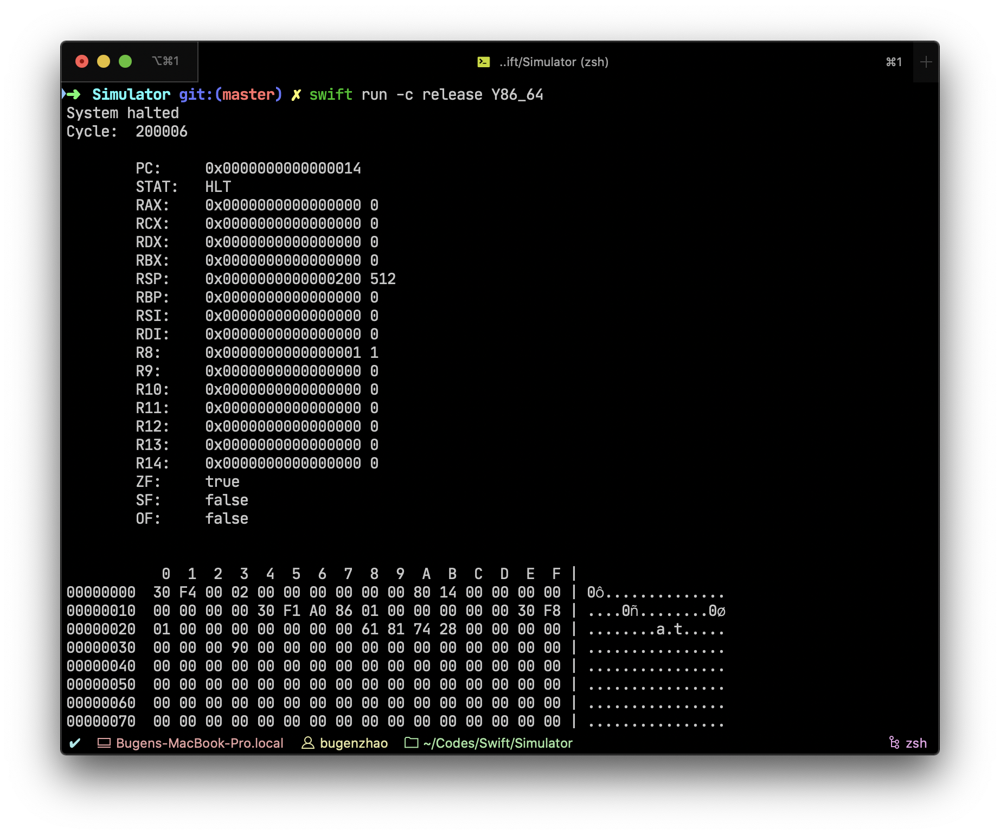

# Simulator


Bugen's logic-circuit-level CPU Simulator, in a descriptive manner. (WIP)

## CPU Simulation

- [x] *CS:APP* Y86-64 Seq ([Sources](Sources/Y86_64SeqLib)) ([Design](Resources/Y86_64SeqDesign.pdf))

  

- [ ] *CS:APP* Y86-64 Pipe

- [ ] MIPS for teaching

- [ ] ...

## Get Started
An example of Accumulator is shown below, check [here](Sources/Simulator/Examples/Accumulator.swift) for more details.


```swift
import Foundation
import SimulatorLib

class Accumulator: Machine {
    public var unitManager = StaticUnitManager()

    var range: ClosedRange<UInt64>
    var ans: StaticRegisterUnit
    var memory: StaticMemoryUnit

    struct WireSet {
        let pcin = Wire("pcin")
        let pcout = Wire("pcout")
        let mem = Wire("mem")
        let adderin = Wire("adderin")
        let adder = Wire("adder")
        let ans = Wire("ans")
        let halt = Wire("halt")
    }

    var wires = WireSet()

    public func run() {
        let time = evaluate {
            repeat {
                unitManager.clock()
            } while !unitManager.halted
            print("Sum of \(range) is \(ans[q: 0])")
        }
        let cycle = unitManager.cycle
        print("Performance of \(type(of: self)): ")
        print("\t\(cycle) cycles in \(time) sec, \(Double(cycle) / time) cycles per sec")
    }

    public init(_ range: ClosedRange<UInt64>) {
        self.range = range
        
        // Get a set of wires
        let w = self.wires

        // Add units
        _ = unitManager.addRegisterUnit(
            unitName: "PC",
            inputWires: [w.pcin],
            outputWires: [w.pcout],
            logic: { ru in w.pcout[0...31] = ru[l: 0] },
            onRising: { ru in var ru = ru
                ru[l: 0] = w.pcin[0...31]
            },
            bytesCount: 4
        )
        memory = unitManager.addMemoryUnit(
            unitName: "memory",
            inputWires: [w.pcout],
            outputWires: [w.mem],
            logic: { mu in
                let addr = w.pcout[0...31]
                w.mem.v = mu[q: addr]
            },
            onRising: { _ in },
            bytesCount: 8 * (range.count + 10)
        )
        _ = unitManager.addGenericUnit(
            unitName: "pcadder",
            inputWires: [w.pcout],
            outputWires: [w.pcin],
            logic: {
                w.pcin[0...31] = w.pcout[0...31] + 8
            }
        )
        _ = unitManager.addGenericUnit(
            unitName: "adder",
            inputWires: [w.adderin, w.ans],
            outputWires: [w.adder],
            logic: {
                w.adder.v = w.adderin.v + w.ans.v
            }
        )
        _ = unitManager.addGenericUnit(
            unitName: "isnot0",
            inputWires: [w.mem],
            outputWires: [w.halt, w.adderin],
            logic: {
                let cond = w.mem.v == ~0.u64
                w.halt.b = cond
                w.adderin.v = cond ? 0 : w.mem.v
            }
        )
        ans = unitManager.addRegisterUnit(
            unitName: "ANS",
            inputWires: [w.adder],
            outputWires: [w.ans],
            logic: { ru in w.ans.v = ru[q: 0] },
            onRising: { ru in var ru = ru
                ru[q: 0] = w.adder.v
            },
            bytesCount: 8
        )
        _ = unitManager.addHaltUnit(
            unitName: "halt",
            inputWires: [w.halt]
        )

        // Check if there's any illegal wire
        _ = unitManager.ready()

        // Fill the input range into memory
        for (addr, data) in zip(0..<range.count.u64, range) {
            memory[addr] = data
        }
        
        // End flag: ~0
        memory[range.count.u64] = ~0.u64
    }
}


let accumulator = Accumulator(0...100000.u64)
accumulator.run()
```

```
Sum of 0...100000 is 5000050000
Performance of Accumulator:
    100002 cycles in 0.44538172 sec, 224530.9933241086 cycles per sec
```


## Build and Run
This project is built with *Swift Package Manager*, to run the simulator, simply execute:

```bash
swift run -c release Simulator
swift run -c release Y86_64
```

## Copyleft

**BugenZhao, Apr. 2020**
