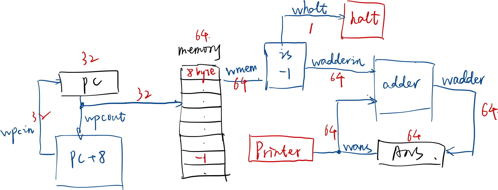

# Simulator


Bugen's logic-circuit-level CPU Simulator, in a descriptive manner. (WIP)

## Example
An example of Accumulator is shown below:



```swift
// Input range
let range = 0...10000.u64

var unitManager = UnitManager()

_ = unitManager.addRegisterUnit(
    unitName: "PC",
    inputWires: ["wpcin"],
    outputWires: ["wpcout"],
    logic: { wm, ru in wm.wpcout[0...31] = ru[l: 0] },
    onRising: { wm, ru in
        var ru = ru
        ru[l: 0] = wm.wpcin[0...31]
    },
    bytesCount: 4
)
var memory = unitManager.addMemoryUnit(
    unitName: "memory",
    inputWires: ["wpcout"],
    outputWires: ["wmem"],
    logic: { wm, mu in
        let addr = wm.wpcout[0...31]
        wm.wmem[0...63] = mu[q: addr]
    },
    onRising: { _, _ in return },
    bytesCount: 8 * (range.count + 10)
)
_ = unitManager.addGenericUnit(
    unitName: "pcadder",
    inputWires: ["wpcout"],
    outputWires: ["wpcin"],
    logic: { wm in
        wm.wpcin[0...31] = wm.wpcout[0...31] + 8
    }
)
_ = unitManager.addGenericUnit(
    unitName: "adder",
    inputWires: ["wadderin", "wans"],
    outputWires: ["wadder"],
    logic: { wm in
        wm.wadder[0...63] = wm.wadderin[0...63] + wm.wans[0...63]
    }
)
_ = unitManager.addGenericUnit(
    unitName: "isnot0",
    inputWires: ["wmem"],
    outputWires: ["whalt", "wadderin"],
    logic: { wm in
        let cond = wm.wmem[0...63] == ~0.u64
        wm.whalt.b = cond
        wm.wadderin[0...63] = cond ? 0 : wm.wmem[0...63]
    }
)
ans = unitManager.addRegisterUnit(
    unitName: "ANS",
    inputWires: ["wadder"],
    outputWires: ["wans"],
    logic: { wm, ru in wm.wans[0...63] = ru[q: 0] },
    onRising: { wm, ru in
        var ru = ru
        ru[q: 0] = wm.wadder[0...63]
    },
    bytesCount: 8
)
_ = unitManager.addHaltUnit(
    unitName: "halt",
    inputWires: ["whalt"]
)

_ = unitManager.wireManager.examine()

// Fill the input into memory
for (addr, data) in zip(0..<range.count.u64, range) {
    memory[q: addr * 8] = data
}
// End of input
memory[q: range.count.u64 * 8] = ~0.u64

// Run until halted
repeat {
    unitManager.clock()
} while !unitManager.halted

print("Sum of \(range) is \(ans[q: 0])")
```
## Build and Run
This project is built with *Swift Package Manager*, to run the simulator, just run:

```bash
swift run
```
